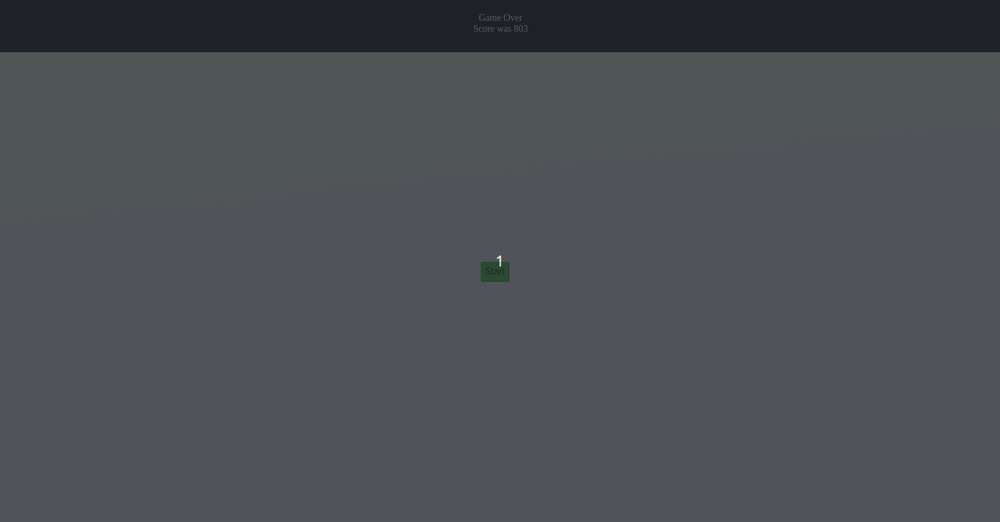

# JavaScript Racing DOM Game

### Description

**JavaScript Racing** is an adrenaline-packed racing game where players maneuver their car to avoid obstacles and earn points. Developed with HTML, CSS, and JavaScript, this game delivers a thrilling experience coupled with captivating visuals.

### Features

- **Dynamic Gameplay**: Race your car, dodge enemies, and strive for the highest score.
- **Pause & Resume**: Easily pause the game mid-action and resume from where you left off.
- **Score Tracking**: Watch your score climb as you master the game.
- **Immersive Design**: Dive into the game with a dedicated game area, smoothly animated cars, and road lines.
- **Responsive Controls**: Use arrow keys for smooth car movements and the space bar to pause.

### JavaScript Techniques

- **DOM Manipulation**: Extensive use of the Document Object Model (DOM) to control game elements and dynamics.
- **Event Handling**: Capturing and handling key press events for game controls.
- **Game Logic**: Algorithms and logic to handle car movements, collisions, scoring, and game states.

### JavaScript functionality:

1. **DOM Elements**:

   - References to several DOM elements such as the score display, start button, game area, pause screen, and pause score.

2. **Player Object**:

   - An object `player` that tracks various player attributes including speed, score, and a flag indicating if the game is paused.

3. **Keys Object**:

   - An object `keys` to keep track of which arrow keys or space key are pressed.

4. **Arrays for Game Elements**:

   - Arrays `lines` and `enemies` to presumably store the road lines and enemy cars respectively.
   - A variable `car` which might represent the player's car.

5. **Event Listeners**:

   - Listeners for the start button click, keydown, and keyup events.

6. **Game Pause Functionality**:
   - Based on the key press functions, it appears that pressing the space bar toggles the game's paused state. A pause screen is displayed when the game is paused.
